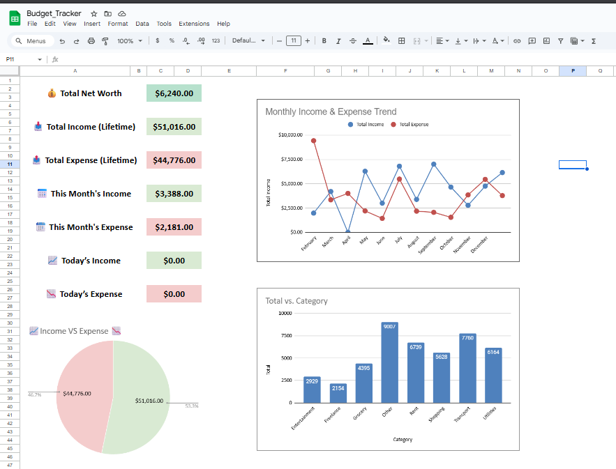
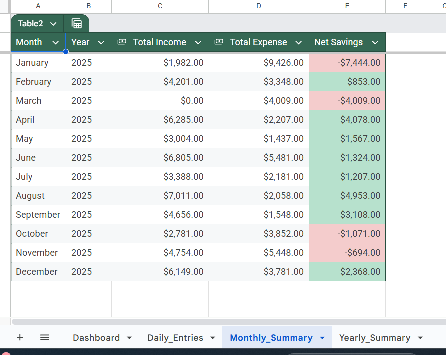
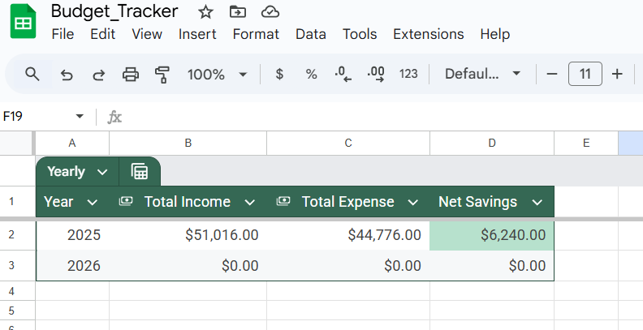

# 💰 Budget Tracker in Excel

A powerful and user-friendly Excel-based **Personal Budget Tracker** designed to help you track your **daily income and expenses**, view **monthly and yearly summaries**, and analyze your **net worth** — all through dynamic dashboards and visualizations.

---

## 📊 Features

- ✅ **Daily Tracking Sheet** – Log incomes and expenses with category, date, amount, and notes.
- 📆 **Automatic Monthly & Yearly Summaries** – View income, expenses, and savings by month and year.
- 🧮 **Net Worth Calculation** – Lifetime net worth card on the dashboard.
- 📉 **Dynamic Dashboard** – Total income, total expense, monthly & daily metrics.
- 🧁 **Charts** – Monthly income & expense trend, category-wise spending (Pie/Donut).
- 📅 **Date Picker Support** – Simplified entry with calendar selector.
- ⚙️ Fully Automated – All summaries update based on daily entries.

---

## 📸 Screenshots

### 🧮 Dashboard Overview  

### 📆 Monthly Summary  

### 📈 Yearly Summary  

---

## 📂 What's Inside?

| File | Description |
|------|-------------|
| `Budget_Tracker.xlsx` | The full-featured budget tracker with dashboards and formulas. |
| `README.md` | Project documentation. |
| `screenshots/` | Folder containing visual previews. |

---

## 🛠 Built With

- Microsoft Excel / Google Sheets
- SUMIFS, QUERY, FILTER, and dynamic functions
- Conditional formatting, charts & dashboard design

---

## 📥 How to Use

1. Download or clone this repository.
2. Open `Budget_Tracker.xlsx`.
3. Start entering your daily income and expenses in the **Daily_Entries** sheet.
4. Watch all metrics auto-update on **Dashboard**, **Monthly**, and **Yearly Summary** tabs.

---

## 🔒 Optional Setup

To prevent accidental edits:
- Go to the **Dashboard** sheet → `Data` > `Protect sheet` → Select who can edit.
- Lock formulas or layout as needed.

---

## 🙋‍♂️ Author

**Muhammed Ameer Suhail**  
📎 [Connect on LinkedIn](https://www.linkedin.com/in/muhammedameersuhail/)

---

## ⭐ If you found this project useful...
Don't forget to star ⭐ the repo and share it with others!

---

